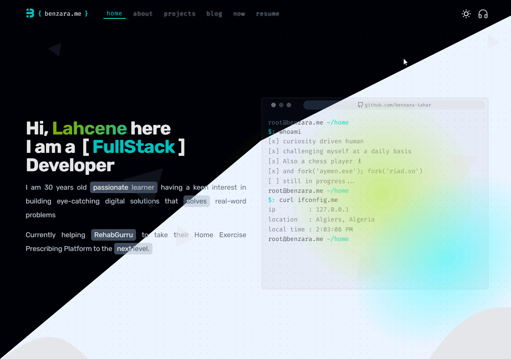

# 🏠 Benzara.me 2022 (WIP🚧)

My Portfolio website for 2022 made with sveletekit ❤

## 🚀 Getting Started

1. Clone repository `git clone https://github.com/benzara-tahar/benzara.me`
2. Install dependencies `cd benzara.me && npm install`
3. Start next dev server `npm run dev`

Now you should have a dev server available at http://localhost:3003!

## 🔩 Features

- SvelteKit
- Typescript
- TailwindCSS
- MDX
- Prism Syntax Highlighting
- Supabase
- [supabase-comments-extension](https://github.com/malerba118/supabase-comments-extension)

## 🚧 Contributing

All contributions are welcome, please stick to the `prettier` settings!

## 📖 License

MIT
